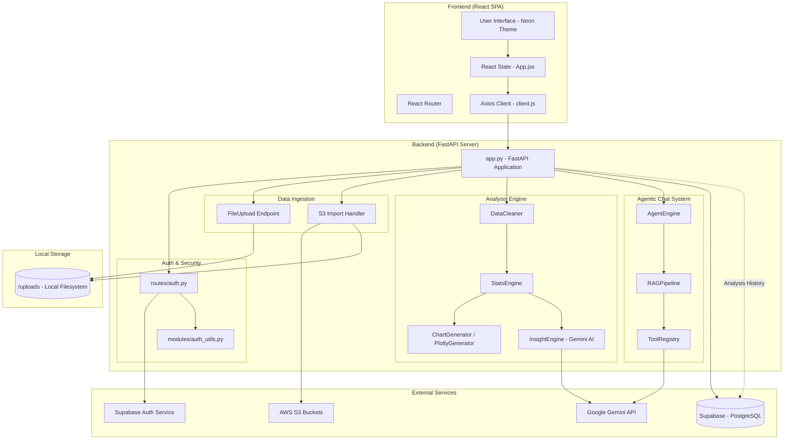

# 📊 ZeroAnalyst - System Architecture & Analysis

Detailed technical documentation of the ZeroAnalyst platform's architecture, data flow, and components.

---

## 🏗️ System Architecture Diagram

---

## 🧩 Component Analysis

### 1. Data Processing Pipeline
The core of the application is a synchronous pipeline that transforms raw data into structured insights:
- **DataIngestion**: Handles both `multipart/form-data` uploads and remote S3 fetching. It validates file types and sizes before persisting them to the local `uploads/` directory.
- **CleaningModule**: Uses `Pandas` to perform automated cleaning (handling NaNs, duplicates, and type inference).
- **StatisticsEngine**: Performs mathematical analysis on numerical data and frequency analysis on categorical data.
- **VisualizationEngine**: Generates Plotly-compatible JSON objects for dynamic, interactive rendering on the frontend.

### 2. AI & Agentic Layer
The "Zero" in ZeroAnalyst stands for zero configuration. The AI layer is split into two parts:
- **InsightEngine**: A batch processor that sends statistical summaries to Gemini Pro to generate human-readable narrative insights.
- **AgentEngine**: A stateful chat assistant that uses a **RAG (Retrieval-Augmented Generation)** approach. It uses a `ToolRegistry` to allow the AI to "choose" how to query the data based on user questions.

### 3. Database & Authentication
We use **Supabase** as a "Backend-as-a-Service":
- **PostgreSQL**: Stores user metadata and analysis history.
- **Row-Level Security (RLS)**: Crucial for privacy; ensures User A cannot see User B's analysis history or file metadata.
- **JWT**: The backend issues its own JWTs for certain operations while relying on Supabase for primary authentication.

---

## 🔄 Data Flow Sequence

1.  **Ingestion**: User selects a file (S3 or Local) -> Sent to `/api/upload` or `/api/upload-from-s3`.
2.  **Validation**: Backend validates file -> Saves to disk -> Returns preview to frontend.
3.  **Process**: User clicks "Analyze" -> Frontend sends filepath to `/api/analyze`.
4.  **Compute**: Backend loads file -> Cleans -> Statistical Analysis -> Gemini Insight Generation.
5.  **Persistence**: Metadata (filename, size, user_id) is saved to the `analysis_history` table in Supabase.
6.  **Response**: Frontend receives the full analysis payload and renders the dashboard.
7.  **Interaction**: User asks questions -> AgentEngine processes message -> Uses RAG over the local file -> Returns real-time AI response.

---

## 🛠️ Security Architecture

- **Token Isolation**: All sensitive API calls require a Bearer JWT.
- **S3 Security**: Supports both Public URLs and Authenticated (IAM) access for private buckets.
- **Data Privacy**: Files are stored locally on the server; Supabase only stores the metadata and references, keeping the heavy data out of the cloud DB.
- **Environment Safety**: All API keys (Gemini, Supabase, AWS) are managed via a strictly ignored `.env` system.
